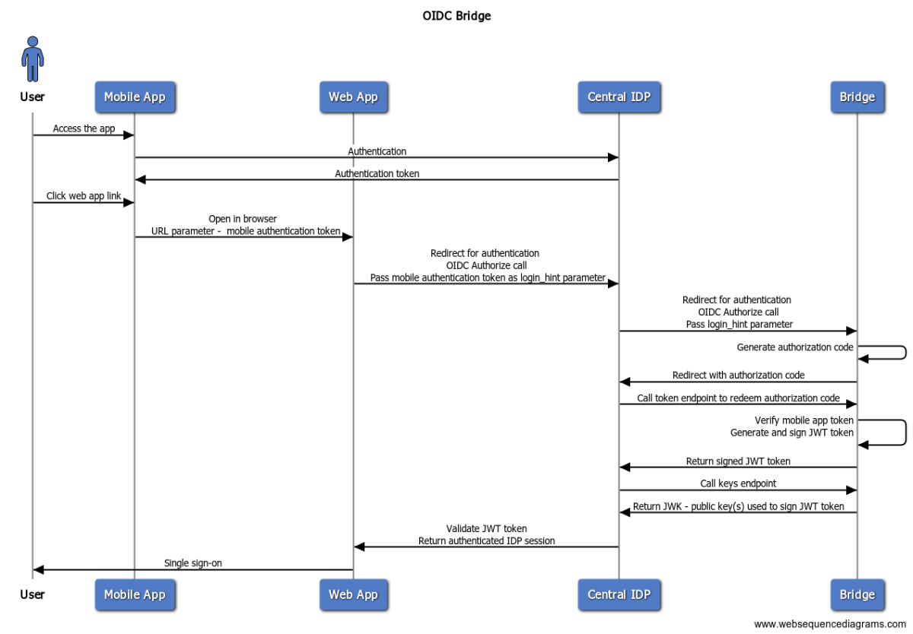

In this article, I will introduce the **Identity Bridge framework**. This framework leverages protocol-compliant techniques to ensure secure single sign-on between native mobile and web-based applications. It aims to close a critical gap in modern application authentication related to seamless integration between mobile and web applications.

## Background

Modern authentication protocols, such as SAML and OpenID Connect (OIDC), rely heavily upon federation as the guiding principle to secure front-door authentication. Federation, as I explained in this [article](https://iam.twisec.com/User-Credentials-and-Federation/), is an elegant approach for web-based applications to isolate authentication from the application using a trust established between the centralized identity provider (**IDP**) and a subscribing application. Armed with asymmetric key-based digital certificates, federation ensures that an application can securely leverage an external IDP service for authentication and free itself from the burden of handling user interaction during the authentication process.

With federation comes the concept of single sign-on (**SSO**). Suppose the centralized IDP already has established a secure authentication session. In that case, multiple applications can benefit from being able to single sign-on and bypass redundant login, improving user experience and reducing authentication frictions.

## Limitation with current protocols

However, federation exhibits limitations with modern applications, especially native mobile applications. Consider the scenario of an insurance provider's mobile application using biometric authentication with a central IDP. Once a user logs in to the application, she might want to go to a banking partner web application, for instance, by clicking a link inside the application. For a seamless user experience, the expectation is to transparently log the user in with SSO to the partner web application. 

The partner web application can be configured to use the same central IDP, but federation does not work since the mobile app does not have any easy way to share an existing IDP session with the web app. The de-facto technique for web SSO is using browser **cookies**, something that the native mobile app can not share with the mobile's system browser. As a result, the partner application that opens in the system browser does not know there has been an existing session, and SSO does not happen. Instead, the user would have to re-authenticate to the partner app. 

A potential solution is to use a shared identifier other than a browser cookie. That approach works well for SSO between mobile apps. Since both apps reside on the same device, they can securely share a session identifier using other forms of secure storage, such as the keychain in iOS devices. There is a standard specification for [native-to-native SSO](https://openid.net/specs/openid-connect-native-sso-1_0.html) with OIDC.

Unfortunately, there is no obvious way to implement SSO in a native-to-web scenario using industry standards. Often, individual applications resort to insecure ad hoc approaches.

## Identity bridge concept

The identity bridge framework attempts to provide an architecture that applications can use to implement native-to-web SSO securely, staying close to the industry standard OIDC protocol. Since the protocol does not have a mechanism to support SSO out of the box, it needs a few additional constructs.

First, the bridge relies on the central IDP's ability to delegate authentication to another IDP. This capability is known as inbound federation. Most commercial and open-source IDPs support inbound federation. Technically, communication between the two IDPs can use any federation protocol (SAML or OIDC) independently. However, the framework recommends OIDC since the industry is increasingly adopting it for new applications.

Also, a service that we will call the **`Bridge`** service needs to be deployed. It will act as the inbound IDP communicating with the central IDP using OIDC. The bridge does not need a user interface; it will simply work as a proxy redeeming the mobile app authentication token for a web SSO session from the central IDP.

## A model Bridge Framework

Here is a model of basic architecture for the bridge -

There is a lot to unpack here:

* The user opens the mobile app and authenticates with the central IDP.
* Central IDP issues an **authentication token** to the application. For OIDC, the **ID Token** can be considered as the authentication token.
* The user then clicks on a web link (for the target web application) inside the mobile application.
* The web link opens in the system browser. The link also contains the authentication token as a parameter.
* The web application extracts the authentication token.
* The web app application initiates an OIDC authentication with the central IDP. First, it redirects to the IDP's `/authorize` endpoint. It also passes the authentication token in the `login_hint` parameter.
* The central IDP initiates another OIDC authentication flow, with the bridge acting as the inbound IDP. It passes on the `login_hint` parameter, which contains the authentication token from the mobile app.
* The bridge then generates a temporary `authorization_code` for one-time use and redirects back to the central IDP with the authorization code.
* The central IDP makes an `HTTP POST` call to the bridge's `/token` endpoint.
* The bridge validates the authentication token obtained from the mobile app passed through the `login_hint` parameter in the previous step. Using information from the source authentication token, it generates a new `JWT` token, signs it using its private key, and returns it to the central IDP.
*  Next, the central IDP calls the `keys` endpoint of the bridge to obtain the public key to verify the signed JWT token.
*  After the JWT is validated, the central IDP creates a web session and completes the authentication process by redirecting back to the web application.

	
## Okta makes it easy to implement the bridge

Implementing the above framework is straightforward with Okta.

Here is a prototype of the bridge service using Okta - [OIDC Bridge](https://github.com/indranilokg/oktatokentoweb/tree/main/OIDCBridge)

Sample applications for testing: [Native app](https://github.com/indranilokg/oktatokentoweb/tree/main/sample-direct-auth) and [Web app](https://github.com/indranilokg/oktatokentoweb/tree/main/sample-redirect-auth)

## Limitations and additional thoughts

Although the framework is designed using standard OIDC protocol, it is not without its limitations.

First, a proxy service must be deployed and maintained, adding an additional component to the solution.

Also, the vanilla architecture does not deal with many token security aspects. If additional measures are not taken, with a leaked mobile authentication token, bypassing authentication in the web application is possible. 

One implementation consideration to protect the token is not using the original authentication token from the mobile application. Mobile applications tend to have long-lived tokens, and using them to perform SSO with a web application greatly increases the risk of session compromise.

For example, with Okta, the following strategy can be taken -
before starting the web SSO, use the mobile authentication token to obtain a separately scoped ultra-short-lived token using Okta [token exchange](https://developer.okta.com/docs/guides/set-up-token-exchange/main/), which is based on the [standard protocol for token exchange](https://datatracker.ietf.org/doc/html/rfc8693). Use the new token to perform SSO instead of the original token for the mobile app. 
	
The ideal solution would be direct protocol support for native-to-web SSO. This would help avoid the additional component and reduce implementation complexity for token security. Several promising works are underway to create industry standards in this space. 