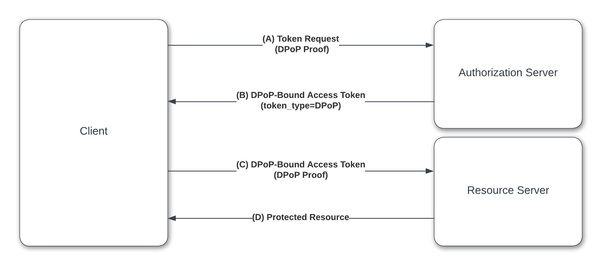

In this article, we will explore how authentication tokens in applications integrated with [Okta Workforce Identity Cloud (WIC)](https://www.okta.com/workforce-identity/) can be protected from misuse, using a relatively new [OAuth 2.0](https://oauth.net/2/) extension [Demonstrating Proof of Possession (DPoP)](https://www.ietf.org/archive/id/draft-ietf-oauth-dpop-04.html).

### DPoP overview

Regular OAuth 2.0 tokens are vulnerable to theft and impersonation. 
They are just [bearer tokens](https://oauth.net/2/bearer-tokens/) that can be used by any one just like the legitimate client. This can result in **token stealing**, **token replay** and **account takeover** attacks. 

The goal of DPoP is to cryptographically bind an access token to a particular client to which the token has been issued. It enables the client to demonstrate **proof-of-possession** of the access token. Every API or resource accessed by the client, can then demand for the proof before granting access. In effect, the access token becomes locked to the client it has been generated for. The token is not useful elsewhere, for example when an attacker tries to call an API using the stolen token.

DPoP works at the [application layer](https://www.okta.com/identity-101/osi-layers/) and has the following basic flow -



At a high level -

* The client generates a [private-public key pair](https://www.gartner.com/en/information-technology/glossary/public-key-cryptography).

* Then the client creates a [JSON Web Token (JWT)](https://oauth.net/2/jwt/) embedding the generated *public key*, and signs the *JWT* with the corresponding *private key*. Only the client has access to the *private key*. The signed JWT is customarily called a **DPoP proof**.

* While making an OAuth 2.0 token request to the [authorization server](https://developer.okta.com/docs/concepts/auth-servers/), the client passes the **DPoP proof** along with the standard token request parameters.

* The authorization server validates the **DPoP proof** using the supplied *public key* inside the **DPoP proof** *JWT*.

* While generating the *access token*, the authorization server embeds the *public key* inside the token itself, and finally issues the token to the client.

* When the client calls a resource (**API**) using the token, it passes both the **DPoP proof** and the *access token* to the resource server.

* The resource server validates the **DPoP proof** by using the embedded *public key* inside the *access token*. That way the resource server confirms that the sender of the **DPoP proof** and the owner of the *access token* is the same client. The resource server finally grants access to the intended resource.


### DPoP with WIC

The following diagram explains how [DPoP flow](https://developer.okta.com/docs/guides/dpop/main/) is implemented with WIC -


#### Highlights

* DPoP is supported in different types of [OpenID Connect(OIDC)](https://www.okta.com/openid-connect/) applications - *Web*, *SPA*, *native* and *service* applications. 

* Once an OIDC application is enabled for DPoP, then it cannot be used to generate a regular [bearer token](https://oauth.net/2/bearer-tokens/).

* DPoP support for *service* applications can provide additional protections for *machine-to-machine* authentication scenarios and [IoT](https://www.zdnet.com/article/what-is-the-internet-of-things-everything-you-need-to-know-about-the-iot-right-now/) integration at scale.

* **DPoP proof** is passed as an HTTP header parameter `DPoP`. Okta mandates use of this header value when calling the OAuth2.0 `/token` endpoint that generates [refresh](https://oauth.net/2/refresh-tokens/) and/or [access](https://www.oauth.com/oauth2-servers/access-tokens/) tokens. 

* While calling an API with a DPoP bound access token, the value for the HTTP header `Authorization` needs to start with `DPoP` instead of `Bearer`. 

* DPoP bound token generation needs 2 consecutive calls to the `/token` endpoint. 
	* The first call causes an error response from Okta bearing a **nonce** value to be included in the **DPoP proof** during the next call to the `/token` endpoint. 
	* Okta refreshes the nonce value every 24 hours.
	* Final **DPoP proof** to the `/token` endpoint also needs to include a one time use random string in the claim `jti`. The same `jti` value can not be reused in subsequent **DPoP proofs**.

* **DPoP proof** needs to be passed when a refresh token is used to generate a new access token.

* **DPoP proof** validation needs to be done offline at the resource server. The access token can however be validated offline or online with OAuth 2.0 `/introspect` endpoint.


#### DPoP protection for Okta API

Okta APIs can be protected with scoped DPoP bound access tokens. When any Okta management API is called, Okta acts like a resource/API server.  

* While calling an Okta API, the **DPoP proof** must contain the Base64 encoded SHA-256 hash of the issued access token in the claim `ath`. While it is always the best practice to use the `ath` claim when calling any (non-Okta) API, Okta resource server mandates its use.

### Integrate application with WIC using DPoP

Let's look at how an application can be integrated with WIC leveraging DPoP bound tokens.

#### Generate DPoP bound token

In order to generate a DPoP bound access token, consider the following steps -

* Configure an OIDC application in Okta with standard settings and additionally **enable** DPoP.


* From the application (client) code, generate a public/private key pair for use with DPoP in the format of [JSON Web Key (JWK)](https://datatracker.ietf.org/doc/html/rfc7517). Extract the private key from the JWK in [PEM format](https://www.ssl.com/faqs/how-can-i-get-my-certificates-in-pem-format/) and the public key in JSON format.

*NodeJS example*

```
var jose = require('node-jose');

dpopKeystore = jose.JWK.createKeyStore();
  dpopKeystore.generate('RSA', 2048, {alg: 'RS256', use: 'sig' })
  .then(result => {
    publicKey  = result.toJSON();
    privateKeyPEM  = result.toPEM(true);
    publicKeyPEM  = result.toPEM(false);
    ........
```

* Generate a [JSON Web Token (JWT)](https://oauth.net/2/jwt/) and sign the JWT with the PEM formatted private key. The signed JWT would be used as the **DPoP proof** HTTP header.

	* Specify the URL of the token endpoint of Okta's [Org](https://developer.okta.com/docs/concepts/auth-servers/#org-authorization-server) or [custom](https://developer.okta.com/docs/concepts/auth-servers/#custom-authorization-server) authorization server in the `htu` claim.

	* Set the value *POST* for the `htm` claim to indicate that the `token` endpoint is called via **HTTP POST**.

	* Specify `dpop+jwt` as value for the header attribute `typ`

	* Include the public key JSON in the header attribute `jwk`


*NodeJS example*

```
var jwt = require('jsonwebtoken');

const claims = {
  htm: "POST",
  htu: "https://{yourOktaDomain}.com/oauth2/default/v1/token",
}

dpopJWK= jwt.sign(claims,privateKeyPEM,
            { 
              algorithm: 'RS256',
              header:
                {
                  typ: 'dpop+jwt',
                  jwk: publicKey
                }
            }
          );
```

* When the WIC `/token` endpoint is called by the client, add the HTTP request header `DPoP` holding the **DPoP proof**.

* At this point, Okta would observe that there is no **nonce** value present inside the signed JWT. It would return an error to the application with a `dpop-nonce` HTTP header to use it as **nonce** value.

* Extract the **nonce** from the HTTP response header


*React example*

```
fetch('https://{yourOktaDomain}.com/oauth2/default/v1/token', {
        method: 'post',
          headers: {'Accept':'application/json', 'Content-Type':'application/x-www-form-urlencoded',  'DPoP':dpopheader},
          body: new URLSearchParams({
            client_id: currentParams.clientId,
            redirect_uri: currentParams.redirectUri,
            grant_type: 'authorization_code',
            code_verifier:currentParams.codeVerifier,
            code: queryParameters.get("code")
          })
        })
        .then(res => {
            const nonce = res.headers.get("dpop-nonce");
```

* Generate a new **DPoP proof** HTTP header, this time with the **nonce** embedded in the claim. Also add a random value as `jti` claim. The `jti` claim ensures that the **DPoP proof** is used only once. Once Okta processes a request with this **DPoP proof**, it will automatically reject its subsequent use.

*NodeJS example*

```
var claims = {
      htm: "POST",
  	  htu: sampleConfig.resourceServer.tokenHtu,
      nonce: req.body.nonce,
      jti: crypto.randomBytes(20).toString('hex')
    }
 dpopJWKWithNonce= jwt.sign(claims,privateKeyPEM,
            { 
              algorithm: 'RS256',
              header:
                {
                  typ: 'dpop+jwt',
                  jwk: publicKey
                }
            }
          );
 res.json({
  dpopheader: dpopJWKWithNonce
});
```

* Okta would generate and return an access token and bind the token to the client's public key. It does this with the claim `cnf` which contains a sub-claim `jkt` holding the [SHA-256 thumbprint](https://academic-accelerator.com/encyclopedia/public-key-fingerprint) of the public key.

```
{
  "ver": 1,
  .....
  "cnf": {
    "jkt": "2HR2BW5-tan1aI6yIPHVOHwirAy4kQGWULoQHKUO0s4"
    },
   ...... 
  "sub": "user@example.com"
}
```

#### Call protected API 

After the client receives DPoP bound token from Okta, it can use the token to call a protected API -

* First create a new **DPoP proof** for the resource server. 

	* The JWT claim needs to have  appropriate HTTP method (`htm` claim) and intended API to call (`htu` claim).

	* It is recommended that a claim `ath` is included that contains the Base64 encoded hash of the bound access token. This claim is mandatory when the intended resource is an Okta API.

	* Sign the JWT with the same private key PEM generated by the client.

*NodeJS example*

```
var claims = {
    htm: "GET",
    htu: "https://example.com/api/example",
    ath: "aI6yIPHVOHwirAy4kQGWULoQHKUO0s4"
  }
   dpopJWKForResource= jwt.sign(claims,privateKeyPEM,
              { 
                algorithm: 'RS256',
                header:
                  {
                    typ: 'dpop+jwt',
                    jwk: publicKey
                  }
              }
            );
   console.log("---DPoP Proof - for Resource ---");
   console.log(dpopJWKForResource);
   res.json({
    dpopheader: dpopJWKForResource
  });
```


* Call the API and include both the **DPoP proof** and DPoP bound token in HTTP headers.

*React example*

```
fetch("https://example.com/api/example", {
            headers: {
              Authorization: `DPoP ${dpopAccessToken}`,
              DPoP: `${responseJson.dpopheader}`,
            },
          })
```

#### Verify DPoP token at resource server

If the resource server is Okta itself, all the standard DPoP verification automatically is carried out by Okta before granting access and executing the Okta API.

For other API servers the take the following verification steps before granting access to the API -

* Verify that a **DPoP header** is present

*NodeJS example*

```
const dPoPHeaderValue = req.headers.dpop;
  if (!dPoPHeaderValue) {
    return res.status(401).send("Missing DPoP header");
  }
```

* Extract the public key from the **DPoP header**

*NodeJS example*

```
const jwtHeader = jwtDecode(dPoPHeaderValue, { header: true });
  let jktFromDPoPHeader;
  try {
    const publicKey = await jose.JWK.asKey(
      JSON.stringify(jwtHeader.jwk),
      "json"
    );
```

* Verify the signature of the DPoP JWT using the *public key* and `algorithm` values present in the JWT header.

*NodeJS example*

```
const verifiedJwt = await jose.JWS.createVerify(publicKey, {
      algorithms: [jwtHeader.alg],
    }).verify(dPoPHeaderValue);
```

* Verify that the `htu` and `htm` claims are in the DPoP JWT payload and match with the current API request HTTP method and URL.

*NodeJS example*

```
const payload = JSON.parse(verifiedJwt.payload.toString());
if (payload.htm !== req.method) {
  return res.status(400).send("Invalid `htm` claim in DPoP JWT");
}
if (payload.htu !== `${req.protocol}://${req.get("host")}${req.url}`) {
  return res.status(400).send("Invalid `htu` claim in DPoP JWT");
}
```

* If `ath` claim is present then hash and Base64-encode the access token and match with the `ath` claim.


* Extract the DPoP-bound access token from the `Authorization` header, verify the JWT, and extract the claims. You can also use the `/introspect` endpoint to verify and extract the access token claims.

*NodeJS example*

```
const OktaJwtVerifier = require('@okta/jwt-verifier');

const oktaJwtVerifierDPOP = new OktaJwtVerifier({
  clientId: sampleConfig.resourceServer.oidcdpop.clientId,
  issuer: sampleConfig.resourceServer.oidcdpop.issuer,
  assertClaims: sampleConfig.resourceServer.assertClaimsDPOP
});


const authHeader = req.headers.authorization || "";
  const match = authHeader.match(/DPoP (.+)/);
  if (!match) {
    return res.status(401).send("Invalid DPoP authorization");
  }

const accessTokenResponse = await oktaJwtVerifierDPOP.verifyAccessToken(
      accessToken,
      audience
    );
```

* Calculate the `jkt` (SHA-256 thumbprint of the public key as obtained  from the DPoP header)

*NodeJS example*

```
jktFromDPoPHeader = jose.util.base64url.encode(
      await publicKey.thumbprint("SHA-256")
    );
```

* Validate the token binding by comparing the `jkt` sub-claim from the access token with the calculated `jkt`.

*NodeJS example*

```
 if (jktFromDPoPHeader === accessTokenResponse.claims.cnf.jkt) {
      next();
    } else {
      return res.status(401).send("Invalid DPoP key binding");
    }
```


### Summary

Okta supports protecting OAuth 2.0 tokens (access token and refresh token) by binding them to the client's private key. The access token then can be used to access both Okta APIs and external APIs securely.

### Additional reading

[Okta adds support for DPoP](https://www.okta.com/blog/2023/06/a-leap-forward-in-token-security-okta-adds-support-for-dpop/)

[Configure OAuth 2.0 Demonstrating Proof-of-Possession](https://developer.okta.com/docs/guides/dpop/main/)


