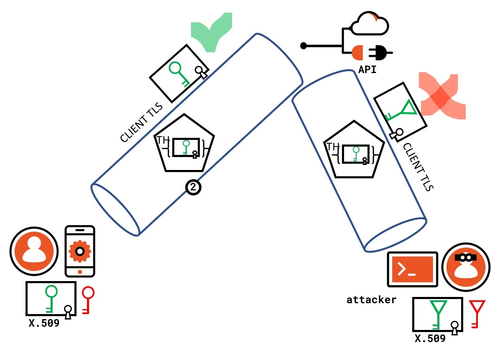
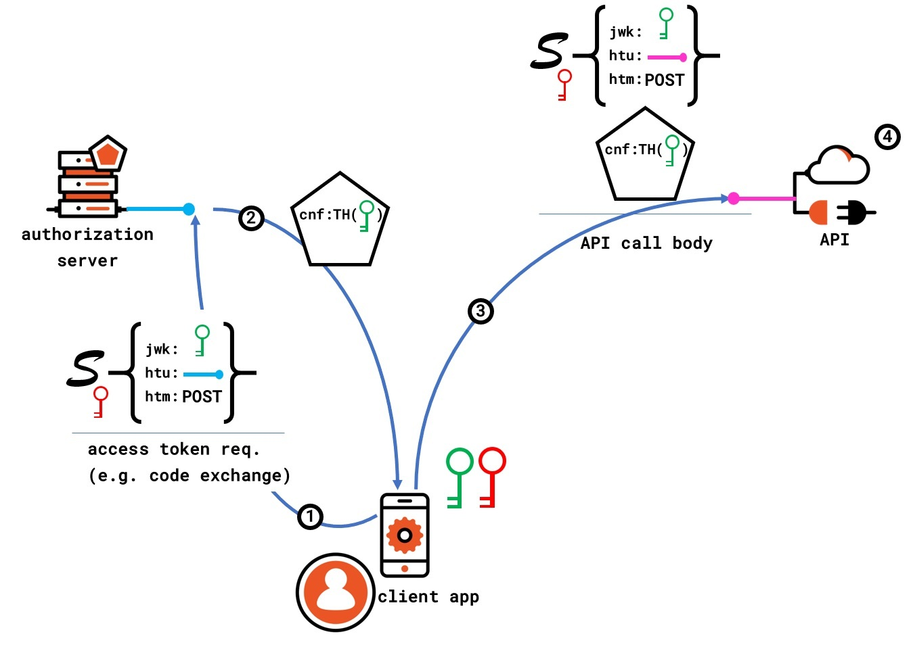
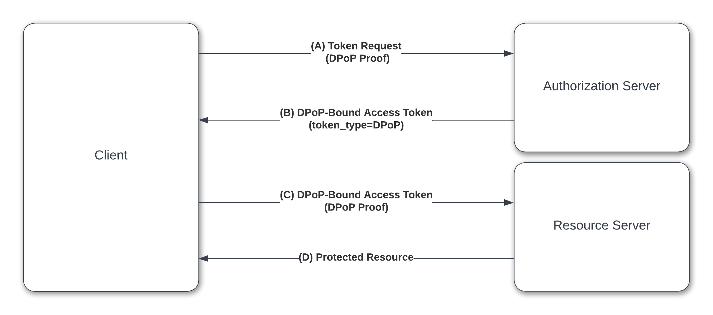

<blockquote>
The chain is only as strong as its weakest link
</blockquote>

With the evolution of cloud based technologies and deployment patterns, authorization tokens from an application are increasingly becoming a target for the bad actors. Consequently token protection is taking shape of an intense battleground between security enforcer and bad actors. 

### Tokens - what are they?

User authenticates to an application through a web based or mobile front-end. During authentication the application typically receives some form of authorization token. The token contains authorization information for the authenticated user. Subsequently, the application uses the token to call API's. With modern [micro-service](https://www.techtarget.com/searchapparchitecture/definition/microservices) based application architectures, a number of API's get called from one or more user facing applications. 

One such widely used token is [JSON Web Token](https://oauth.net/2/jwt/). It is used extensively in popular authorization protocol such as [OAuth 2.0](https://oauth.net/2/) that is being leveraged by an increasing number of applications for calling services and API's. 

### Tokens can be stolen and abused!

Regular OAuth 2.0 tokens are vulnerable to theft and impersonation. 
They are just [bearer tokens](https://oauth.net/2/bearer-tokens/) that can be used by any one just like the legitimate client. This can result in **token stealing**, **token replay** and **account takeover** attacks. 

Tokens are typically stored with client's application session. In case of a web application, common places are the web browser *local storage*, *cookie storage* or *session storage*. Consider that an attacker somehow obtains/steals such an access token. The token can then be used to call the micro-service API's directly from any system. Hence it is important to protect those access tokens to ensure that they do not fall into wrong hands. 

One approach is to have tokens with short expiration time. It shrinks the attack window but does not eliminate it however. 

Identity providers can be configured to enforce [secure client authentication](https://oauth.net/2/client-authentication/) before a token gets issued. This might protect a renewable token such as [OAuth2.0 refresh token](https://oauth.net/2/refresh-tokens/). But once an access token is issued, it is free to be exploited. Moreover, client authentication is not an option for single-page applications (SPA) and mobile applications, which would otherwise need a secure middleware or backend.

### Big Idea: Can tokens be bound to the client? 

This calls for the idea of binding a token with a particular client, much like how [secure web sessions](https://www.okta.com/identity-101/http-vs-https/) work by binding to a particular client (browser). In order to use such a token in an API call, the requester would then need to prove ownership of the token.

Couple of emerging standards in this space are - 

[mTLS Certificate-Bound Access Tokens](https://datatracker.ietf.org/doc/html/rfc8705)

[Demonstrating Proof of Possession (DPoP)](https://www.ietf.org/archive/id/draft-ietf-oauth-dpop-04.html)

### mTLS binding - an ideal solution

Mutual-TLS (mTLS) certificate-bound access tokens ensure that only the party in possession of the private key corresponding to the certificate can utilize the token to access the associated resources. 

Such a constraint is sometimes referred to as **key confirmation**, **proof-of-possession**, or **holder-of-key** and is unlike the case of the bearer token described in [RFC6750](https://datatracker.ietf.org/doc/html/rfc6750), where any party in possession of the access token can use it to access the associated resources. 

Binding an access token to the client's certificate prevents the use of stolen access tokens or replay of access tokens by unauthorized parties.

### Limitations of mTLS binding
	
mTLS is not for the faint hearts though. First of all, mTLS works in [Transport layer](https://www.javatpoint.com/computer-network-transport-layer) of an application network stack. The most secure implementation of it would require client side [PKI infrastructure](https://www.okta.com/identity-101/public-key-infrastructure/). So all the client and API infrastructures need to be able to use mTLS. 

Apart from this being complex and costly to implement and maintain, it is not suitable for SPA or mobile applications, since they run on client side.

### Can something be done at the application layer? Enter DPoP

This brings the question whether **sender-constraining** a token can be addressed at the [application layer](https://www.okta.com/identity-101/osi-layers/), making it simpler and Lightweight. 

**Demonstrating Proof-of-Possession (DPoP)** offers exactly that option. It enables the client to demonstrate that it possesses a particular key or secret associated with the access token, without depending on underlying networking infrastructure as leveraged in mTLS binding.

With DPoP, the goal is to bind an OAuth 2.0 token with client’s [private key] (https://www.okta.com/identity-101/public-key-encryption/). In effect, it allows applications cryptographically bind access tokens to a particular client when they are issued.

Authorization server would embed the corresponding client certificate (public key) in the issued token. Any API/Resource server would validate those tokens to make sure it came from the same client it was issued for.

### Mechanics of DPoP

Here is a basic flow of DPoP based interaction -

At a high level -

* The client generates a [private-public key pair](https://www.gartner.com/en/information-technology/glossary/public-key-cryptography).

* Then the client creates a [JSON Web Token (JWT)](https://oauth.net/2/jwt/) embedding the generated *public key*, and signs the *JWT* with the corresponding *private key*. Only the client has access to the *private key*. The signed JWT is customarily called a **DPoP proof**.

* While making an OAuth 2.0 token request to the authorization server, the client passes the **DPoP proof** along with the standard token request parameters.

* The authorization server validates the **DPoP proof** using the supplied *public key* inside the **DPoP proof** *JWT*.

* While generating the *access token*, the authorization server embeds the *public key* inside the token itself, and finally issues the token to the client.

* When the client calls a resource (**API**) using the token, it passes both the **DPoP proof** and the *access token* to the resource server.

* The resource server validates the **DPoP proof** by using the embedded *public key* inside the *access token*. That way resource server confirms that the sender of the **DPoP proof** and the owner of the *access token* is the same client. The resource server finally grants access to the intended resource.

### Why to use DPoP?

DPoP is a secure alternative to bearer tokens. It increases application/API security posture by preventing token stealing and replay attacks, where an attacker intercepts a legitimate access token and uses it to gain unauthorized access to a protected resource.

This is an important requirement for all Federal customers since as they need to comply with [NIST 800-63C] (https://pages.nist.gov/800-63-3/sp800-63c.html) which mandates the use of hold-of-key like standards for token protection.

DPoP is included in [FAPI 2.0 security profile](https://openid.net/specs/fapi-2_0-security-02.html) which is part of [Financial Grade API (FAPI) 2.0](https://oauth.net/fapi/) adopted by [Open Banking](https://www.okta.com/resources/open-banking-psd2-global-adoption/) initiative. FAPI aims to protect high-value important API's such as in financial institutions applications.

DPoP also shows promise in protecting [Internet of things(IoT)](https://www.zdnet.com/article/what-is-the-internet-of-things-everything-you-need-to-know-about-the-iot-right-now/) devices. Each device can obtain its own curated token that cannot be used outside the device. Apart from providing token protection, DPoP would facilitate easy scaling of IoT solution to millions of devices.

Since no server side PKI infrastructure is needed, DPoP is suitable for sender-constraining tokens in SPA/mobile applications.

### Why to use DPoP NOW?

Despite its promises, DPoP is relatively new and so far has seen a limited adoption. Not many standard and vendor specific libraries are around.

With the current landscape of multi-channel applications and API's, attackers have an expanded attack surface to infiltrate digital systems. A classic example is the [Github incident](https://github.blog/2022-04-15-security-alert-stolen-oauth-user-tokens/), where attackers used stolen OAuth tokens to obtain data from organizations.

Adoption of protocols such as DPoP would allow applications to be steps ahead of the attackers out in the wild.

### The World Is Not Enough!

While adopting DPoP can significantly improve the security posture of an application and especially token protection, it should nevertheless be considered as a one stop solution. 

DPoP proves the identity of the sender using the token, but an application is still prone to other token related attacks, such as [Cross-Site Scripting (XSS) attack](https://owasp.org/www-community/attacks/xss/). If the client is compromised by XSS attack, DPoP can offer little protection from it. In this case, the attacker can obtain the private key from the compromised client, or can get the client generate DPoP signature for use. In either case the attacker can prove possession of a token and hence use it to successfully call protected API's.

DPoP can be a very important tool in securing an application. It augments other established and emerging security practices such as [XSS prevention] (https://cheatsheetseries.owasp.org/cheatsheets/Cross_Site_Scripting_Prevention_Cheat_Sheet.html), that need to be employed in fortifying an application.	

### Summary

Securing digital applications is becoming more challenging than ever. A zero trust approach must be employed that takes care of all security aspects of an application. Token protection with techniques such as DPoP that demands proof of possession before a token use is granted, is an extremely valuable component in the defense in depth toolbox.

### Additional reading

[OAuth 2.0 Demonstrating Proof-of-Possession at the Application Layer (DPoP)](https://www.ietf.org/archive/id/draft-ietf-oauth-dpop-04.html)

