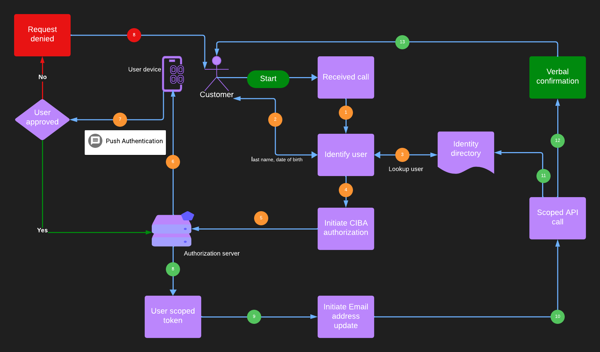

Digital applications need to deal with identities all the time. It is important to verify identity at the application front door in the form of authentication. There are several mature and sophisticated techniques and standards for user authentication, such as [OIDC](https://auth0.com/docs/authenticate/protocols/openid-connect-protocol) and [SAML](https://developer.okta.com/docs/concepts/saml/), which allow a trusted identity provider (IDP) to securely authenticate the user before allowing access to an application.

But front door authentication is not the only context where identities need to be verified. 

Consider the following scenarios -

* `Update email address through a bank's customer service`

* `Recover user-id/password through HelpDesk`

* `Securely perform a transaction at a retail Point of Sale (POS) system`

* `Authenticate with IVR or smart speaker`

* `Authenticate from a shared kiosk` 

In each of the above cases, though the identities need to be verified, it might not be possible or appropriate to have the user perform authentication through an interactive login interface such as a web browser.

## How do applications handle this today?

While it is popular to leverage secure IDP and standards to provide initial authentication through a login interface, identity verification in places such as above is built in an ad-hoc manner. Depending on design some applications carry this out inefficiently with terrible customer experience, while others are less secure and vulnerable. 


### Let's step through a couple of scenarios

#### Update email address for bank account

Consider a user calls-in customer service to update her email address associated with her bank account. Often the helpline personnel asks the user for certain [PII](https://www.techtarget.com/searchsecurity/definition/personally-identifiable-information-PII) information such as last name, date of birth, and last 4 digits of social security number. Upon verification, the helpline personnel updates the email address through the customer care application, which performs privileged operations to the bank's identity database to change the user record. 


There are a few problems with the approach. 

**First,** the customer experience is not great, and also the customer needs to provide PII information for verification, which an attacker can guess or obtain using [social engineering](https://csrc.nist.gov/glossary/term/social_engineering). This can easily lead to an account takeover where a fraudulent actor can successfully pass the verifications and can infiltrate the account with the new email ID.

**The second issue is,** the customer care application needs to make a change to the user profile from the backend without authentication. The application would typically use powerful credentials to perform such a privileged operation. For example - an application can obtain and use a token with user management privileges to call the user update API. Such a token provides the ability to update any user account in the banking system directory and can be misused if the token gets leaked. 

Won't it be nice to get some form of token that provides the application with just enough privilege to update only the calling user profile? That way it could adhere to the [least privilege](https://csrc.nist.gov/glossary/term/least_privilege) principle of security.


#### POS payment

This is another interesting scenario. When a user tries to pay in the retail Point of Sale (POS) system with a bank account, she won't be comfortable signing in to her bank account on a shared device providing her credentials. 

Instead, it would be ideal if the POS system could somehow allow to securely make payments with an alternative form of verification where the user does not need to provide her credentials in a public system! 

Can something be done to ***decouple*** user authentication from the application?

## Is there a way to perform such verification securely and consistently? Enter CIBA  

The idea is to decouple authentication from the application so that the authentication can be initiated in one device and verified in another. `Client-Initiated Backchannel Authentication (CIBA)` allows exactly that separation. 

CIBA is a relatively new authentication flow based on [OAuth2](https://oauth.net/2/) in which the client can initiate an interaction flow to authenticate the users without having end-user interaction from the `consumption device`. The flow involves **back-channel** communication from the client to the OAuth2 authorization provider without redirecting through the user's browser (`consumption device`). The authentication would be verified independently from a separate `authentication device` such as a phone or smartwatch, in possession of the user and has been securely enrolled with the provider.

### Let's unpack a bit more

Consider the following flow for our banking email address use case -




1. The customer care application initiates an authentication event for the user. It sends a direct CIBA request to the authorization server.

2. Unlike a regular login page the user is redirected to, the authorization server sends a push notification to the user's phone.

3. When the user accepts the notification on her phone/smartwatch, the authorization server is notified.

5. The authorization server then issues a user token to the application. The application uses the user-scoped token to complete the target operation - updating the email address.

A few **benefits** of this approach are -

1. The user experience becomes smoother during verification. It also can instill confidence in users that the system operates securely.

2. Push notification offers higher security than other out-of-band user authentication methods such as SMS one-time code (OTP).

3. The application token can be narrowly scoped to the user providing the least privileged access.


Here is a simplified flow of a transaction using CIBA -


### Through the Looking-glass

* CIBA is an extension on top of [OIDC](https://openid.net/developers/how-connect-works/), which itself is based on the [OAuth2](https://oauth.net/2/) framework. It brings in a new OAuth2 grant type in the family - `urn:openid:params:grant-type:ciba`

* As customary with the [OIDC discovery endpoint](https://openid.net/specs/openid-connect-discovery-1_0.html), CIBA introduces additional metadata parameters, such as - `backchannel_token_delivery_modes_supported`, `backchannel_authentication_endpoint`

```
{
"issuer":"...",
"authorization_endpoint":".../authorize",
"token_endpoint":".../token",
"userinfo_endpoint":".../userinfo",
"jwks_uri":"...",
"grant_types_supported":["authorization_code","refresh_token","password","urn:openid:params:grant-type:ciba"],
"backchannel_token_delivery_modes_supported":["poll", "ping", "push"],
"backchannel_authentication_endpoint": "",
....
}

```

* The `backchannel_token_delivery_modes_supported` parameter needs some additional commentary. The specification defines 3 different modes of notifying the client about the completion of authentication. 

	* **Poll:** In this mode, the client would keep polling the authorization server until the authentication is complete or the event times out. In case of successful authentication, the final poll would return the tokens to the application. This mode is the simplest and easy to implement.

	* **Ping:** When the authentication is complete, it will call back to a registered URL of the client notifying the status. The client would then send a request to the authorization server to receive the tokens.

	* **Push:** When the authentication is complete, it will call back to a registered URL of the client with the tokens.

	`Ping` and `Push` modes are more complex to implement and need
	additional metadata and implementation steps on the client side. 	However, it saves network trips caused by the polling cycle.

* Since the CIBA request uses a back-channel, it needs to contain a parameter that the authorization server can use to identify the user. Typically the parameter is supplied using the `login_hint` or `id_token_hint` parameter of the request.


* The authentication device performs out-of-band authentication instead of traditional authentication flow where the client sequentially interacts with the authorization server. In practical implementations, it would be a push notification to a device such as a phone or smartwatch. The device needs to be securely registered to the authorization server for the user so that it knows where to send the authorization request. The push notification can be delivered either by embedding the mechanism in the application's mobile application or using a companion authenticator application.

## Security considerations

CIBA is vulnerable to attacks akin to [MFA fatigue attack](https://www.bleepingcomputer.com/news/security/mfa-fatigue-hackers-new-favorite-tactic-in-high-profile-breaches/#google_vignette). Consider the case where an attacker guesses a user id or infiltrates a user account, and repeatedly attempts to carry out a sensitive transaction implemented using CIBA authorization. The real user might get overwhelmed by repeated push notifications and end up accepting one.

A related scenario is when the attacker has a list of user IDs and initiates transactions for each of them. While the majority of users would ignore the push prompt, a small percentage could approve the request.

In summary, CIBA suffers from the weakness where an attacker can force initiate an authorization event. In certain scenarios, a more secure alternative is the [device code flow](https://datatracker.ietf.org/doc/html/rfc8628) where a user can actively initiate authorization on her device using a QR code or one-time code.

Also, CIBA should not be used in the same-device scenario where the consumption and the authentication device are the same.

   
## Adoption 

CIBA is not yet widely implemented. [Okta](https://okta.com) has been an early adopter of the CIBA standard.

CIBA is rapidly gaining traction in the banking industry.
[Financial-grade API (FAPI)](https://darutk.medium.com/financial-grade-api-fapi-explained-by-an-implementer-d09fcf2ff932), developed based on the [OAuth2](https://oauth.net/2/) token model, includes the [CIBA profile](https://openid.net/specs/openid-financial-api-ciba.html). [Okta Customer Identity Cloud](https://www.okta.com/customer-identity/) offers FAPI support with its [Highly Regulated Identity](https://www.okta.com/products/regulated-identity/) offering.

In Europe, CIBA can be instrumental in implementing **decoupled authentication** flows outlined by [PSD2 and UK Open Banking](https://www.okta.com/resources/whitepaper/implications-around-psd2-and-open-banking/). [Consumer Data Right (CDR)](https://www.accc.gov.au/by-industry/banking-and-finance/the-consumer-data-right) in Australia is expected to include the specification in the near term.

Beyond the banking industry, CIBA is proving to be promising in providing enhanced security and user experience to the Helpdesk, customer service, retail Point of Sale (POS), [IVR](https://www.ttec.com/glossary/interactive-voice-response), and shared kiosk-based applications.

## CIBA with Okta

[Okta Workforce Identity Cloud](https://www.okta.com/workforce-identity/) supports CIBA with `pull` mode. The feature is called [Transactional Verification](https://developer.okta.com/docs/guides/configure-ciba/main/). As part of the support, the [Okta authorization server](https://developer.okta.com/docs/concepts/auth-servers/) includes the CIBA grant. 

The authentication process is supported by allowing the creation of a **mobile push authenticator** using [Okta device SDK](https://www.okta.com/blog/2020/10/showcase20-introducing-the-okta-devices-sdk-and-api-a-better-way-to-secure-and-delight-mobile-users/). This SDK can be easily embedded in the organization's mobile application or as a separate companion application. Check out the [ios](https://developer.okta.com/docs/guides/authenticators-custom-authenticator/ios/main/) and [android](https://developer.okta.com/docs/guides/authenticators-custom-authenticator/android/main/) guides on how to implement a branded push authenticator using the SDK. The guides include sample applications to get you quickly started on building the experience. 
   

## Summary

Digital applications are crucial for every business and securing them is of paramount importance. It is not enough to protect just the front door with authentications. Applications need to be vigilant all the time during their operations and operate on a [zero trust](https://www.nist.gov/publications/zero-trust-architecture) model. CIBA is an important tool to ensure that continuous and secure authorization is enforced by the applications in appropriate contexts without compromising the user experience.


## Additional resources

[CIBA specification](https://openid.net/specs/openid-client-initiated-backchannel-authentication-core-1_0.html)

[Configure CIBA with Okta](https://developer.okta.com/docs/guides/configure-ciba/main/)

[Okta Highly Regulated Identity](https://auth0.com/docs/secure/highly-regulated-identity)


