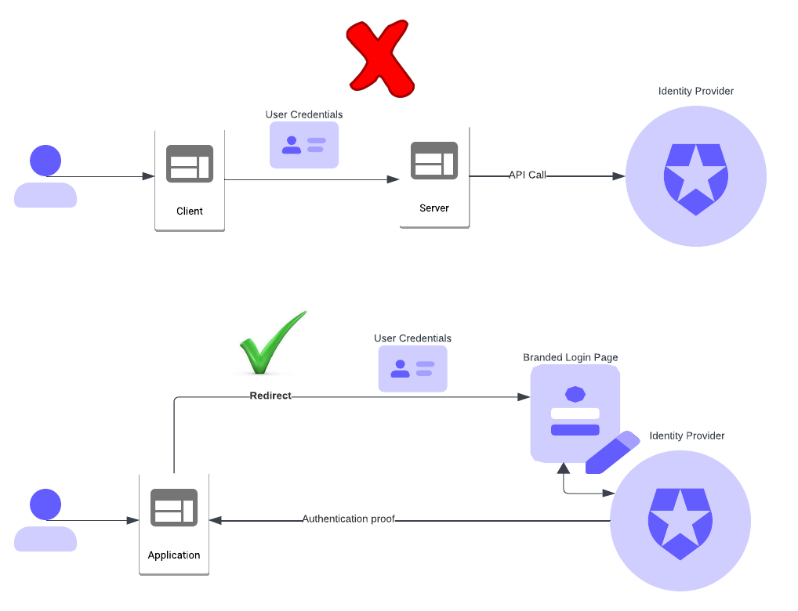

# Is your application still capturing user credentials

Are you developing new applications or planning to modernize the existing applications in your organization? Ensure you have done your due diligence on how the application captures the authenticating user **credentials**. This is a subtle and often overlooked aspect of application authentication. With the rise of credential theft attacks, failing to plan for adequate guardrails around the application's access to user credentials, can make your organization vulnerable to breaches.

## A brief history of authentication

The digital application architecture has undergone numerous transformations since its inception, for example from client-server multi-page application to single-page application (**SPA**) model. Authentication and authorization technologies for the applications have evolved in parallel.

Traditionally, the individual application or the application server container would manage authentication against a directory/LDAP or database repository. During authentication, the application would collect the username and password from the front-end interface and send them to the server for verification. The server, in turn, would check the credentials against the database or directory before granting access.

With the above architecture, the application needs to take several security measures to ensure that the user credentials collected through the front-end authentication process are not exposed. Examples of such measures are -

* The clear-text passwords are not written to log files or included in debug statements.

* Passwords are not accessible through session variables to protect them during a session takeover incident.

* Application backdoors are not able to obtain the credentials.

Then came the concept of [federated identity](https://www.okta.com/identity-101/what-is-federated-identity/). The idea was to offload the authentication activity to a trusted identity provider (**IDP**). That way the application would not have access to user credentials at any point and instead trust the IDP-supplied proof of authentication. 

The Security Assertion Markup Language (**SAML**) and WS-Federation were leading standards on federation. Currently, OpenID Connect (**OIDC**) is the leading federation standard due to its ease of use with the SPA and mobile applications.

## Are applications embracing federated identity?

Even though the federation approach takes the burden of managing credentials away from the applications, a significant percentage of existing applications have not adopted federation.

Leading IDPs such as [Okta Workforce Identity Cloud (WIC)](https://www.okta.com/workforce-identity/) and [Okta Customer Identity Cloud (CIC)](https://www.okta.com/customer-identity/) are built to provide best-of-breed federation support. However, I often see a paradoxical situation with organizations planning to adopt external IDP for authentication. On numerous occasions, I am asked about the IDP's ability to support authentication requests over API. 

While Okta CIC and WIC support direct API-based authentication, an application still needs to capture the credentials and implement security measures to protect them.

Some of the reasons for organizations to adopt API-based authentication or stick to traditional authentication methods are - 

* Complete control of the user interface and branding. An external IDP often fails to meet the needs.

* Organization security policy mandates an API-first approach.

* Perception that redirecting to an IDP-hosted page is less secure. 

* Redirecting to an IDP involves additional network trips and therefore affects performance.

* Simply the inertia of doing it differently

If it were a few applications accessed through the company firewall, the traditional or API method could have been sufficient. But with hundreds of internet-facing web, SPA, and mobile applications in a growing organization, the attack surface would be greatly expanded. Each of the applications needs to be carefully designed to protect against any credentials exposure, increasing implementation and maintenance efforts. Auditing security controls for all applications would also add to the cost.	

## Call to action

While deciding on the authentication approach for your applications, consider federating with a trusted IDP such as Okta CIC and WIC. That way you can seamlessly take care of protecting the user identities regardless of the number of applications you have.

* Okta CIC and WIC have strong branding features with custom UI templates, bring-your-own-domain, accessibility, and per-application branding support. With these features, you will be able to create the perfect branded experience in your authentication flow.

* A redirection to IDP happens over **HTTPS** in which the communication is protected through Transport Layer Security (**TLS**) encryption. The federation flow is as secure as the API call, which also works over HTTPS.

* There is an additional network trip with federated authentication which might have a slight performance impact compared to direct API calls. Evaluate your authentication performance needs against the overheads and risks introduced in your applications with having to protect user credentials from being exposed.

* If you have a large or growing number of internet-facing applications, you have a bigger attack surface for credentials breaches. If your organization's security policy mandates API use for authentication, perhaps it is a good time to revisit the policy.

