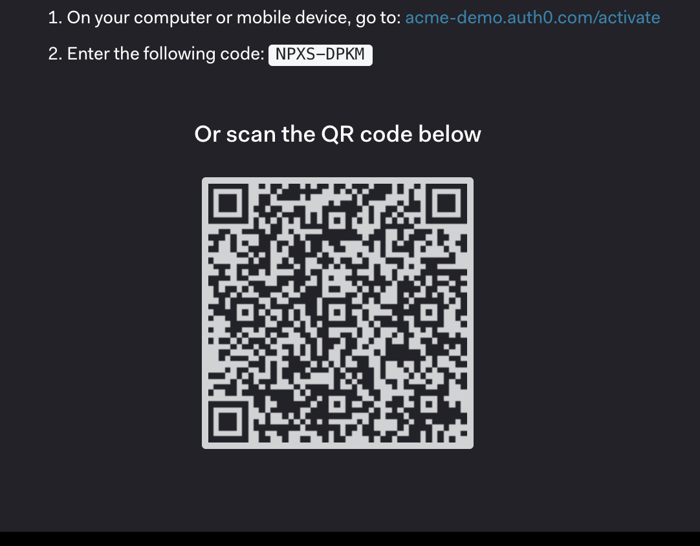

Authentication with shared devices comes with its unique set of challenges. Some scenarios are specific to an organization's workforce whereas some use cases are consumer specific. In this article, I will focus on the consumer scenarios, and explore the challenges and possible options to address shared device authentication securely. 

## Challenges with shared device authentication 

Many organizations and services employ kiosks and shared devices to improve customer experience, operational efficiency through self-service, and scalability with consumer growth. Some notable examples are kiosks deployed in retail point-of-sale (POS) systems, entertainment and event centers, hotels, airports, libraries, and medical clinics.

In the consumer scenario, the main challenges are -

* The user needs to provide her authentication credentials on a public device. This increases the risk of credential exposure and can hurt consumer adoption.

* The user session can remain active after she moves away from the system without explicitly signing out, leading to the risk of session takeover.

* Enforcing phishing-resistant biometrics authentication such as passkeys is not feasible.

Often applications handle shared device authentication in a rather proprietary manner, for example, using RFID readers, official document or payment card scanners, etc. Also, many systems prompt for traditional user ID and password authentication such as computers in a library.

## Decoupled authentication with the shared device

A better way could be to decouple authentication from the application running on the shared device. If the authentication can be carried out using a trusted device, often a smartphone or tablet in possession of the user, some of the challenges can be addressed seamlessly -

* The user never needs to provide credentials or identifying information to the application running on the shared devices.

* Phishing-proof biometrics authentication can be easily used since the user authenticates from the personal device.

Let's look at a couple of popular decoupled authentication standards - [CIBA](https://openid.net/specs/openid-client-initiated-backchannel-authentication-core-1_0.html) and [OAuth 2.0 Device Authorization Grant](https://datatracker.ietf.org/doc/html/rfc8628)

## CIBA is promising but suffers from weaknesses

**CIBA** is an elegant way to decouple authentication from the application. However, as I discussed in the **`Security considerations`** section of the [article](https://iamse.blog/2024/04/19/securely-verify-transactions-can-ciba-lead-the-way/), it is vulnerable to **MFA fatigue attacks**. With CIBA an attacker can force initiate an authorization event and wait for user consent. If a legitimate user approves an authorization prompt by mistake, the attacker immediately gets access to the application.

Moreover, since the authentication is initiated from the application, the user needs to provide identifying information to begin the CIBA flow. The consumer can have privacy concerns about providing her email address or other login identifiers to the shared device.

Most CIBA implementations rely on push notifications-based approval. If you are considering CIBA as the potential solution, ensure that the push notification is at least protected by biometrics or challenges such as number matching to guard against MFA fatigue attacks.

## Making a case for device authorization flow

**Device authorization flow** provides a better alternative in this scenario. The idea is -

- The application creates a randomized login URL and a user code. It can also embed the URL and the user code in a QR code. The application then displays the information to the user.

- The user can scan the QR code or manually type in the login link on her device browser.

- She would then complete the authentication flow on her device by supplying her credentials. For sensitive applications, the authentication process can include phishing-resistant factors such as **passkeys**.

- Finally, she enters the user code.

- Once the authorization process is complete, the shared device application will continue with the authentication token received. 

The user never needs to provide any authentication information on the shared device. Instead of consenting to an authorization challenge (like with CIBA), she performs the end-to-end authentication on the trusted device. 

The device authorization flow was originally designed for input-constrained devices such as TV or command line interfaces (CLI). In shared devices, the user credentials are not safe. That makes the flow an ideal candidate for shared device authentication.

Here is how the OAuth 2.0 device authorization flow works -

## Session management and logout

Even if the device authorization flow is suitable for front-line authentication in shared devices, the application or the system still needs to manage the sessions and tokens. 

The tokens should have a low expiry time and never be stored in persistent storage, unlike those in TV or smart devices where typically long-live tokens are warranted.

The application should also reset the session, and clear the `access token` and `device code` immediately after the browser or application is closed. 

The application or the device must track user inactivity, and time-out within a short threshold. Upon time-out, it should promptly reset the user session and clear tokens.

## Fallback option

What if the user is not carrying a personal device suitable for authentication? The application should also have a suitable fallback login option, for example, SMS or email OTP-based password-less authentication. For completeness, the application can also allow traditional password-based login albeit with a great deal of caution and instructive messages displayed to the user.

## Okta supports device authorization flow

**Okta Customer Identity Cloud (Auth0)** has built-in support for device authorization flow. 
Check out this [tutorial](https://auth0.com/docs/get-started/authentication-and-authorization-flow/device-authorization-flow/call-your-api-using-the-device-authorization-flow) for detailed implementation guidance. Also, visit this [playground](https://auth0.github.io/device-flow-playground/) for an interactive experience with Auth0 device authorization flow.

**Okta Workforce Identity Cloud (WIC)** also supports the flow. Here is the configuration [guide](https://developer.okta.com/docs/guides/device-authorization-grant/main/) for WIC.

## Summary

Device authorization flow, although originally conceived to address authentication for input-constrained devices, is an excellent tool for handling consumer authentication from shared devices. Auth0 makes it easy to implement shared device authentication securely with out-of-the-box support for device authorization flow.

## Additional reading

[OAuth 2.0 Device Authorization Grant Specification](https://datatracker.ietf.org/doc/html/rfc8628)

[Auth0 Device Authorization Flow](https://auth0.com/docs/get-started/authentication-and-authorization-flow/device-authorization-flow)

