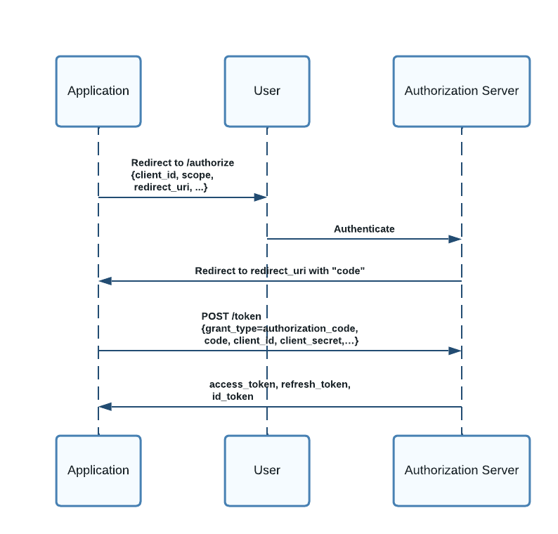
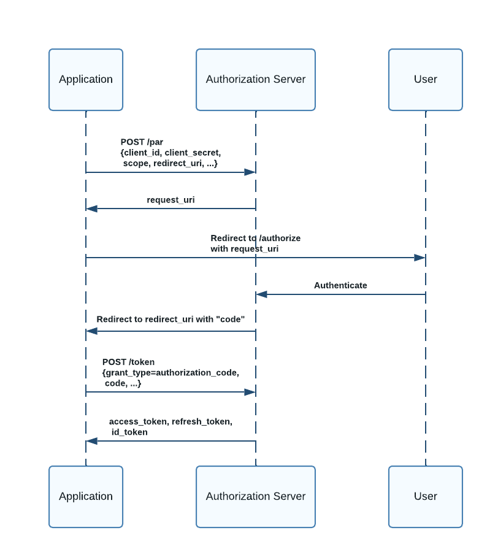

Digital applications have widely adopted the ubiquitous **OAuth 2.0** framework, which became popular due to its universal nature of working seamlessly across the web, SPA, or mobile applications to provide authentication and authorization services.

However, concerns have been raised about the confidentiality and operational aspects of the core framework, especially with the way it initiates an authorization process. The attackers are finding novel ways to exploit weaknesses at the protocol level. 

This article will look at **Pushed Authorization Request (PAR)**, a relatively new extension on top of OAuth 2.0, that addresses these confidentiality and usability issues.

## Issues with the conventional flow

The standard OAuth 2.0 Authorization Code flow is as follows -

If you notice closely, the application initiates the flow by redirecting to the authorization server's `/authorize` URL. The authorization details are passed as URL query parameters and are visible to the web browser. The application thus divulges information even before the authorization server authenticates the client.

Since the browser can see the authorization parameters in clear text, they will be part of the browser history. The attacker can thus build a profile of the application just by attempting to authenticate to the application. This is problematic for regulated applications where the requested `scopes` could often be sensitive and **confidential** information. Moreover, this information can also appear in web server logs and be available to other websites if the application uses a referrer site.

Using the collected application profile the attacker can have a field day to launch attacks such as **password spray attack** since the client does not need to be authenticated until after the user authorization process is complete. Although the authorization server can have other mechanisms to detect such attacks, there is no protocol-level protection at the authorization layer.

There are also risks related to the **integrity** of the authorization request. Passing details such as `scopes` as part of the URL parameters enables the attacker to modify them and change the authorization context. Such manipulations can not be detected early with the traditional flow.

Finally, organizations with many applications and APIs often design their authorization system using several OAuth 2.0 `scopes`. As a result, the `/authorize` URL can become quite large. There is no stipulation in the HTTP specification on the maximum size of a URL. Different browsers allow for various size limits. It can easily lead to unknown behavior with an arbitrarily large number of URL parameters when a browser fails to process the URL. While it is not a good practice to model fine-grained authorization with many OAuth 2.0 `scopes`, the authorization flow does not have guardrails around it.

## PAR addresses the weaknesses with the URL parameters

Pushed authorization request (PAR) takes a slightly different approach to initiating an OAuth 2.0 authorization flow. It decouples the parameter submission and client authentication from the user authentication process.

First, the client creates an authorization request containing all the required parameters and sends this directly to the authorization server via an HTTP POST request. The parameters are never sent as URL parameters and are not exposed through the browser.

The authorization server then validates the request and authenticates the client, establishing trust between the client and the authorization server before user interaction begins. Upon validation, the authorization server generates a random URL `request_uri` with a short expiry period.

The client's browser is then redirected to the `request_uri`. The authorization server then completes the authentication directly with the user. Following successful authentication, the server redirects to the client with the appropriate authorization code or token, per the usual OAuth 2.0 process.

PAR addresses several security and usability gaps with a minor improvisation to the standard OAuth 2.0 flow.

* **Confidentiality:** Potential sensitive information such as authorization `scopes` are not revealed through the browser avoiding exposure through logs and browser history.

* **Integrity:** PAR prevents attempts to spoof clients or tamper with authorization contexts by modifying `scopes`.

* **Reduction in Attack Surface:** Client authentication early in the process allows the authorization server to reject malicious requests such as **password spray attacks**.  

* **Scalability:** PAR avoids the issues with URL length when an authorization request is designed to leverage a large number of `scopes`.

## Additional Security Considerations

While PAR enhances the security of the OAuth 2.0 process, it should be used with appropriate security postures.

Since PAR requires clients to submit requests directly to the authorization server, it **should** only be used with confidential clients that can securely authenticate with the authorization server leveraging mechanisms such as `client secret`, `private key JWT`, or `mTLS`. Okta Customer Identity Cloud (Auth0) allows PAR only for confidential clients.

To ensure the integrity of a PAR request, it is helpful to implement measures such as employing a signed and optionally encrypted request object. [JWT-Secured Authorization Request (JAR)](https://datatracker.ietf.org/doc/html/rfc9101) OAuth 2.0 extension complements PAR and enhances the integrity of the authorization request. JAR leverages signed/encrypted JSON Web Tokens (JWT) wrapping the parameters of a PAR request to help verify that the request has not been altered/exposed during transmission.

## Use Cases

PAR is particularly beneficial in high-security scenarios like financial services or healthcare applications. PAR is included in the [Financial-grade API (FAPI)](https://darutk.medium.com/financial-grade-api-fapi-explained-by-an-implementer-d09fcf2ff932), developed based on the OAuth 2.0 token model. 

It is also advantageous for handling large or complex requests that are cumbersome to pass through the browser, for example when a large number of OAuth 2.0 `scopes` are requested during an authorization flow.

PAR along with JAR and the [Backend for Frontend (BFF)](https://philcalcado.com/2015/09/18/the_back_end_for_front_end_pattern_bff.html) pattern can provide robust security around authentication in single-page applications (SPA).

## PAR and Okta

[Okta Customer Identity Cloud (CIC/Auth0)](https://www.okta.com/customer-identity/)  offers FAPI support with its [Highly Regulated Identity](https://www.okta.com/products/regulated-identity/) solution and [PAR](https://auth0.com/docs/get-started/authentication-and-authorization-flow/authorization-code-flow/authorization-code-flow-with-par) is a supported component of the solution.

[Okta Workforce Identity Cloud (WIC)](https://www.okta.com/workforce-identity/) supports [PAR](https://developer.okta.com/docs/reference/api/oidc/#par) as well.

### Interesting possibilities with PAR and Auth0

Auth0 supports custom authorization parameters as part of the OAuth 2.0 authorization flow. This capability when used together with PAR, can address complex use cases such as -

* Cross-IDP (identity provider) single sign-on (SSO)

* Co-exist with third-party IDP where Auth0 acts as a multi-factor authentication (MFA) provider

* Mobile to web application SSO

PAR can securely deliver third-party or external authentication tokens to Auth0 through a custom authorization parameter in the above scenarios.

## Conclusion

Pushed Authorization Request (PAR) provides a substantial security improvement over conventional OAuth 2.0 authorization flow. By securely authenticating the client and supplying the parameters early in the process, PAR offers better protection of sensitive authorization data and enhances the overall security architecture of digital applications. Consider using PAR when designing your application's authorization flow whenever possible.

## Additional reading

[PAR Specification](https://datatracker.ietf.org/doc/html/rfc9126)

[JAR Specification](https://datatracker.ietf.org/doc/html/rfc9101) 

[PAR with Auth0](https://auth0.com/docs/get-started/authentication-and-authorization-flow/authorization-code-flow/authorization-code-flow-with-par)

[PAR with Okta WIC](https://developer.okta.com/docs/reference/api/oidc/#par)

[Auth0: Authorization Code Flow with PAR and JAR](https://auth0.com/docs/get-started/authentication-and-authorization-flow/authorization-code-flow/authorization-code-flow-with-par-and-jar)

[The Backend for Frontend pattern](https://auth0.com/blog/the-backend-for-frontend-pattern-bff/)