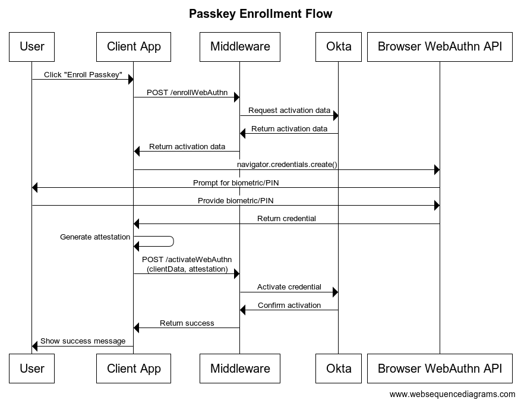
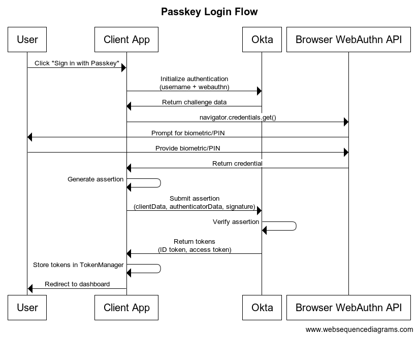

This guide demonstrates how to implement passkey authentication with Okta using a hybrid approach that combines direct API calls for enrollment with the [Okta Auth JS SDK](https://github.com/okta/okta-auth-js) for authentication. Passkeys are [WebAuthn](https://www.w3.org/TR/webauthn/) credentials that provide a more user-friendly authentication experience, built on the WebAuthn standard. They leverage the same underlying technology with additional features such as cross-device synchronization and a more intuitive user experience.

Unlike traditional Okta implementations that rely on redirect-based flows, this approach uses direct API calls to Okta's management API for passkey enrollment, giving you full control over the enrollment process. It leverages the Okta Auth JS SDK for the authentication flow, providing a secure and standardized way to handle passkey sign-in.

This implementation is beneficial for applications that require:

- Custom enrollment flows
- Direct control over the user experience
- Integration with existing authentication systems

The guide will walk you through setting up both the server-side API integration and the client-side SDK implementation, ensuring a secure and seamless passkey experience for your users.

## Prerequisites

- Okta Developer Account
- Node.js application with Express
- Okta Auth JS SDK (version 7.x or higher)
- Modern browser with WebAuthn support

Required npm packages:

```json
{
  "dependencies": {
    "@okta/okta-auth-js": "^7.5.1",
    "express": "^4.18.2",
    "dotenv": "^16.0.3",
    "request": "^2.88.2"
  }
}
```

Environment variables:

```env
OKTA_DOMAIN=https://your-domain.oktapreview.com
OKTA_CLIENT_ID=your_client_id
OKTA_ISSUER=https://your-domain.oktapreview.com/oauth2/default
OKTA_API_TOKEN=your_api_token
REDIRECT_URI=http://localhost:3000/callback
```

## Architecture Overview

The implementation follows a client-server architecture that integrates with Okta's Identity Platform. This architecture ensures secure handling of WebAuthn credentials while maintaining a smooth user experience.

**Enrollment flow ->**




**Authentication flow ->**




## Implementation Steps

### Server-Side Setup

* First, set up the express server with the necessary routes:

```javascript
const express = require('express');
const app = express();
const request = require('request');
require('dotenv').config();

app.use(express.json());
app.use(express.static('public'));

// Configuration endpoint
app.get('/config', (req, res) => {
  const clientConfig = {
    issuer: process.env.OKTA_ISSUER,
    clientId: process.env.OKTA_CLIENT_ID,
    redirectUri: process.env.REDIRECT_URI,
    scopes: ['openid', 'profile', 'email'],
    pkce: true,
    useInteractionCodeFlow: true
  };

  res.json({ clientConfig });
});

// WebAuthn enrollment endpoint
app.post('/enrollWebAuthn', function(req, res) {
  const userId = req.body.userId;
  if (!userId) {
    return res.status(400).json({ error: 'No userId provided' });
  }

  const options = {
    'method': 'POST',
    'url': `${process.env.OKTA_DOMAIN}/api/v1/users/${userId}/factors`,
    'headers': {
      'Accept': 'application/json',
      'Content-Type': 'application/json',
      'Authorization': `SSWS ${process.env.OKTA_API_TOKEN}`
    },
    body: JSON.stringify({
      "factorType": "webauthn",
      "provider": "FIDO"
    })
  };

  request(options, function(error, response) {
    if (error) return res.status(500).json({ error: error.message });
    res.send(response.body);
  });
});

// WebAuthn activation endpoint
app.post('/activateWebAuthn', function(req, res) {
  const { clientData, attestation, activationLink } = req.body;
  
  const options = {
    'method': 'POST',
    'url': activationLink,
    'headers': {
      'Accept': 'application/json',
      'Content-Type': 'application/json',
      'Authorization': `SSWS ${process.env.OKTA_API_TOKEN}`
    },
    body: JSON.stringify({ attestation, clientData })
  };

  request(options, function(error, response) {
    if (error) return res.status(500).json({ error: error.message });
    res.send(response.body);
  });
});
```

### Client-Side Implementation

* Initialize the Okta Auth JS client:

```javascript
let authClient = null;

async function initializeAuth() {
    if (authClient && authClient.tokenManager) {
        return true;
    }

    try {
        const response = await fetch('/config');
        const data = await response.json();
        
        authClient = new OktaAuth(data.clientConfig);
        await authClient.start();
        return true;
    } catch (error) {
        console.error('Failed to initialize auth:', error);
        return false;
    }
}
```

### Passkey Enrollment

* Implementation of passkey enrollment:

```javascript
async function enrollWebauthnFromServer() {
    try {
        const tokens = await authClient.tokenManager.getTokens();
        if (!tokens?.idToken) {
            throw new Error('No ID token found');
        }

        // Start enrollment process
        const enrollResponse = await fetch('/enrollWebAuthn', {
            method: 'POST',
            headers: { 'Content-Type': 'application/json' },
            body: JSON.stringify({
                userId: tokens.idToken.claims.sub
            })
        });

        const enrollmentData = await enrollResponse.json();

        // Create WebAuthn credential
        const options = OktaAuth.webauthn.buildCredentialCreationOptions(
            enrollmentData._embedded.activation,
            enrollmentData._embedded.activation.excludeCredentials
        );
        
        const credential = await navigator.credentials.create(options);
        
        // Get attestation
        const res = OktaAuth.webauthn.getAttestation(credential);

        // Activate the credential
        await fetch('/activateWebAuthn', {
            method: 'POST',
            headers: { 'Content-Type': 'application/json' },
            body: JSON.stringify({
                clientData: res.clientData,
                attestation: res.attestation,
                activationLink: enrollmentData._links.activate.href
            })
        });

    } catch (error) {
        console.error('Error in enrollment:', error);
        throw error;
    }
}
```

### Authentication Flow

* Implementation of passkey authentication:

```javascript
async function loginWithWebauthn() {
    try {
        var transaction = await authClient.idx.authenticate({ 
            authenticator: 'webauthn',
            authenticatorMethod: 'webauthn',
            username: username.value
        });

        if (!transaction.nextStep?.authenticator?.contextualData?.challengeData) {
            throw new Error('WebAuthn authentication not available');
        }

        const challengeData = transaction.nextStep.authenticator.contextualData.challengeData;
        const authenticatorEnrollments = transaction.nextStep.authenticatorEnrollments;

        const options = OktaAuth.webauthn.buildCredentialRequestOptions(
            challengeData,
            authenticatorEnrollments
        );

        const credential = await navigator.credentials.get(options);
        
        const res = OktaAuth.webauthn.getAssertion(credential);

        transaction = await authClient.idx.proceed({
            clientData: res.clientData,
            authenticatorData: res.authenticatorData,
            signatureData: res.signatureData
        });

        if (transaction.status === "SUCCESS") {
            await authClient.tokenManager.setTokens(transaction.tokens);
            window.location.href = '/dashboard';
        }
    } catch (error) {
        console.error("Login error:", error);
        throw error;
    }
}
```

## Additional thoughts

This guide focuses on implementing passkey authentication with Okta using a direct API approach for enrollment and the Auth JS SDK for authentication. While this implementation provides greater control and customization, it's worth noting that Okta's redirect-based model offers additional features, particularly around [discoverable credentials](https://developers.yubico.com/Passkeys/Passkey_concepts/Discoverable_vs_non-discoverable_credentials.html) and cross-application compatibility.

**Important Consideration: Passkey Hostname Binding**

A critical aspect of passkey implementation is that passkeys are bound to specific hostnames (domains). This means passkeys enrolled through this direct API approach will only work on the specific application hostname where they were enrolled. The same passkey cannot be used across different applications, even if they are integrated with the same Okta tenant.


The redirect model leverages Okta's hosted login flow, and offers several advantages:

- Automatic handling of the entire passkey lifecycle
- Built-in support for **discoverable credentials**, allowing users to sign in without entering a username
- **Single passkey enrollment works across all applications using the hosted flow**

However, the direct API approach shown in this guide remains valuable for applications that require custom enrollment flows and user interfaces, integration with existing authentication systems, and full control over the authentication journey.

Both approaches provide the core benefits of passkey authentication - enhanced security through WebAuthn, improved user experience, and phishing resistance.

When choosing between these approaches, consider your application's specific requirements. The **redirect model** for quick implementation, maintenance, discoverable credentials support, and cross-application compatibility. The **direct API** approach for customization, control, and application-specific passkey binding.


	